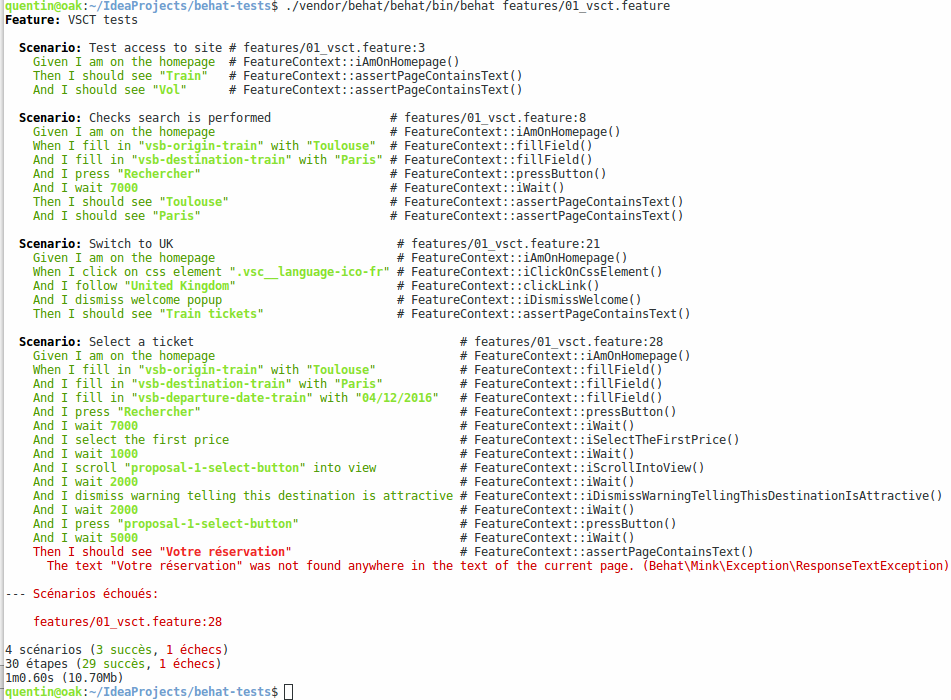
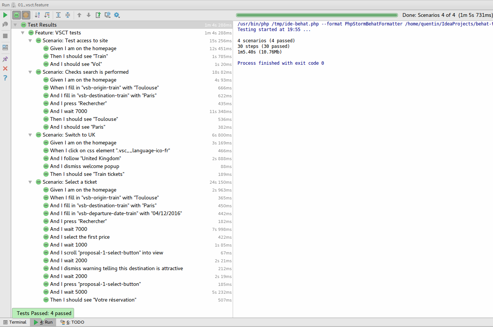
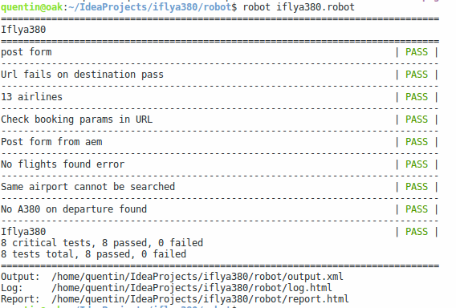
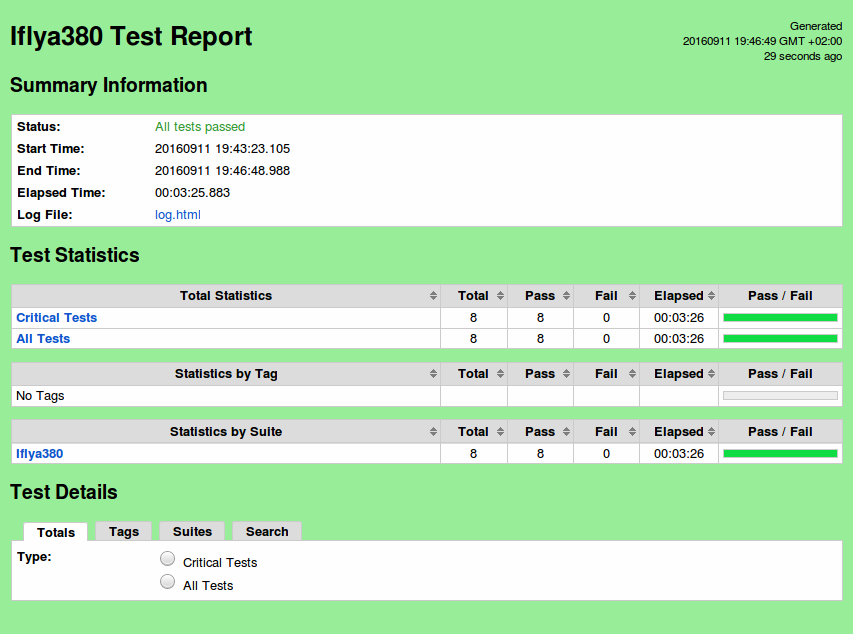

# Behat


## Functionnal tests ?

High level testing, close to end user
Browser automation

## Components ?

Guerkin: high level language

```
 1: Feature: Some terse yet descriptive text of what is desired
 2:   Textual description of the business value of this feature
 3:   Business rules that govern the scope of the feature
 4:   Any additional information that will make the feature easier to understand
 5: 
 6:   Scenario: Some determinable business situation
 7:     Given some precondition
 8:       And some other precondition
 9:     When some action by the actor
10:       And some other action
11:       And yet another action
12:     Then some testable outcome is achieved
13:       And something else we can check happens too
14: 
15:   Scenario: A different situation
16:       ...
```

Behat: official PHP Cucumber implementation for Behaviour Driven Development (BDD)

Mink: Behat extension to integrate with broser (Goutte => simple HTTP scrapping from Symfony or Selenium, needed for JS)

## Installation
Install PHP components with composer commands

```
composer require behat/behat behat/mink-selenium2-driver behat/mink-extension
```

Selenium server is needed:

*   `java -jar selenium-server-standalone-2.53.0.jar -Dwebdriver.chrome.driver=/usr/lib/chromium-browser/chromedriver`
*   nothing needed for FF, extra package (*chromedriver*, distribution dependant) for Chrome + parameter below

## Setup 

```
$ ./vendor/behat/behat/bin/behat --init
+d features - place your *.feature files here => Guerkin scenario files
+d features/bootstrap - place your context classes here => step definitions, PHP code \o/
+f features/bootstrap/FeatureContext.php - place your definitions, transformations and hooks here
```

Check available steps: 

```
$ LANG=C ./vendor/behat/behat/bin/behat -dl
=> empty !
```

Edit defaut context, and extend MinkContext


Basic steps (fill/press) (behat -dl)
```
$ LANG=C ./vendor/behat/behat/bin/behat -dl
default | Given /^(?:|I )am on (?:|the )homepage$/
default | When /^(?:|I )go to (?:|the )homepage$/
default | Given /^(?:|I )am on "(?P<page>[^"]+)"$/
default | When /^(?:|I )go to "(?P<page>[^"]+)"$/
default | When /^(?:|I )reload the page$/
default | When /^(?:|I )move backward one page$/
default | When /^(?:|I )move forward one page$/
default | When /^(?:|I )press "(?P<button>(?:[^"]|\\")*)"$/
default | When /^(?:|I )follow "(?P<link>(?:[^"]|\\")*)"$/
default | When /^(?:|I )fill in "(?P<field>(?:[^"]|\\")*)" with "(?P<value>(?:[^"]|\\")*)"$/

```

## Tests writing

Ready to edit tests!

## Tests execution

Custom steps
Pb of css and xpath filter
=> no id/name => we need to rely on custom (trainline with ember, iflya380)
Pb of Element is not visible (scrollToView)
Intellij integration
setValue() pb (trainline)



## Tooling

Decent intellij integration: code completion, step generation, PHPUnit like exec console



# Robotframework

## Installation

Global installation (to have `robot` in path)

```
pip install robotframework robotframework-selenium2library robotframework-extendedselenium2library
```

No need for a Selenium server \o/ browser launched by robot
To use Chrome, ChromeDriver must be in the PATH

## Setup

Done in *.robot files

## Tests writing

Commands available here:

http://robotframework.org/Selenium2Library/Selenium2Library.html

## Tests execution

```
robot *.robot
```




Keywords (instead of steps)

## Tooling

Ride UI
HTML output provided natively 
Intellij: limited code completion, exec thru external tools

# Sumup

Try to always use regular HTML forms, use ids (#action_button)
Starting writing tests from the start of the project (easier + can be used for regression tests)
Beware with animations (slow down, wait() needed in tests)
